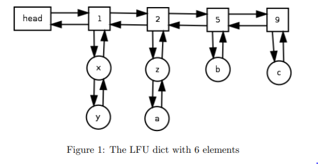
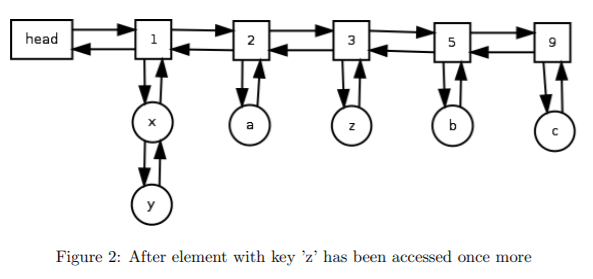

LFU Cache
========================
### First ILab course project
# Building a  project
```
  $ mkdir build
  $ cd build
  $ cmake ..
  $ make
```
# Running tests
To run tests, cd to the project directory `Cache`, then to `build` and run
```
/LFU_cache < ../tests/test1.txt
```
Do the same for other tests.


# Algorithm

A cache eviction algorithm includes 3 different operations on the caches data.
- Set (or insert) an item in the cache.
- Retrieve (or lookup) an item in the cache, incrementing its usage count.
- Evict (or delete) rhe Least Frequently Used item from the cache.

We use:
- a hastable to access elements by key
- a doubly linked list to link together nodes with the same access frequency
- a doubly linked list as the frequency 

The algorithm is shown in the pictures below.


 


 
================


### main resource: http://dhruvbird.com/lfu.pdf