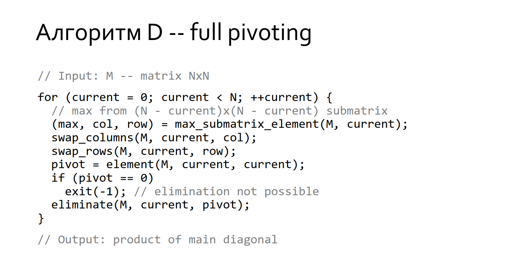

# HWMX: Determinant calculation
### *Input*:
size of the matrix n <br>
elements
### *Output*:
determinant

<br>

# How to build the project

build with:
```
cmake -S ./ -B build/ -DCMAKE_BUILD_TYPE=Release
cd build
make
```
run task with any end2end test:
```
./calc_det < ../test/end2end/my_tests/test_1.txt
```
run task with all end2end tests:
```
for f in ../test/end2end/my_tests/test_*.txt; do ./calc_det < $f; printf '\n'; done
```
# Unit tests (using google test)
if you want to run with unit tests (both for matrix ctors and determinant):
```
cmake -S ./ -B build/ -DCMAKE_BUILD_TYPE=Release -DWITH_TESTS=on
cd build
make
ctest
```
or to see full log:
```
ctest --verbose
```

----------------------------
### Based on algorithm of full pivoting and problem_dt

----------------------------
